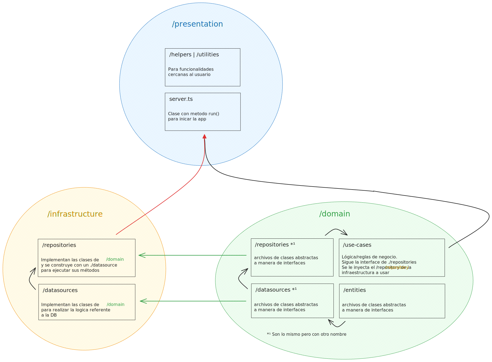

# Node con TS y CLEAN Architecture


## Config TS
[Configuracion de Fer Herrera](https://gist.github.com/Klerith/3ba17e86dc4fabd8301a59699b9ffc0b) con `ts-node` en lugar de `nodemon`

0. Iniciar node con `npm init -y` y crear `src/app.ts` (Es lo que busca ejecutar nom run dev del paso 3)
  
1. Instalar TypeScript y demás dependencias con `npm i -D typescript @types/node ts-node-dev rimraf`
   
2. Inicializar el archivo de configuración de TypeScript (Se puede configurar al gusto) `npx tsc --init --outDir dist/ --rootDir src`
  - Añadir al `tsconfig.json`:
    ```json
    "exclude": [
      "node_modules",
      "dist"
    ],
    "include": [
      "src"
    ],
    ```
  
3. Crear scripts para dev, build y start ([Más sobre TS-Node-dev aquí](https://www.npmjs.com/package/ts-node-dev))
  ```json
    "dev": "tsnd --respawn --clear src/app.ts",
    "build": "rimraf ./dist && tsc",
    "start": "npm run build && node dist/app.js"
  ```


## CLEAN Architecture (arquitectura por capas)
### Objetivo 
Desacoplar la logica de negocio de la infraestrucutra (DB)

### Intro
En esta arquitectura, cada capa tiene una responsabilidad específica y se comunica con las otras capas de una manera definida.

**Notas**:
- Tambien se puede usar para desacoplar el framework de la logica ayudando a agilizar actualizaciones
- MVC (model view controller) no es Clean ya que esta mesclada la infraestructura con la logica


### Estructura
- **Data** (Datos): 
  Esta capa se encarga del **acceso y gestión de los datos**. Incluye la **interacción con la base de datos**, la implementación de repositorios, y otros servicios relacionados con el almacenamiento de datos.

- **Domain** (Dominio): 
  Esta capa contiene la **lógica de negocio central y las reglas del negocio**. Aquí se definen 
  - modelos de dominio, 
  - entidades, 
  - servicios de dominio,  
  - interfaces 
  que definen el comportamiento esperado.

- **Presentation** (Presentación): 
  Esta capa maneja la interfaz de usuario y la interacción con el usuario. Incluye controladores, vistas, y cualquier lógica que gestione la entrada y salida de datos entre el usuario y el sistema.


## Patrones vistos
- ### adapter (adaptador):    [*]
  Carpeta `src/config/plugins`

  Para usar librerias de terceros, cada archivo debe hacer una funcionalidad en especifico.
  Si llegará a cambiar la libreria solo es necesario realizar los ajustes en este archivo y no por toda la logica
  

- ### repository (repositorio):  [noc-app]
  Carpetas (/src/):
    - domain (reglas de negocio)
      - datasource *¹  (Contienen clases abstractas con los metodos necesarios para la logica)
      - entities (entidades | modelos)
      - repository *¹  (Contienen clases abstractas con los metodos necesarios para la logica)
      - use-cases (casos de uso, logica/reglas de negocio. Reciben el repositorio que va a tener la interfaz/forma dicha en `/domain/repository` ) 
    - infrastructure (conexión a DB)
      - datasource (Debe seguir la  clase abstracta de `/domian/datasource/`, y es quien se va a comunicar con la DB, ya sea con un ORM o Vanilla JS)
      - repository (de implementación. Debe seguir la clase abstracta de `/domian/repository/`, es el que se manda a llamar en `server.ts`, y contiene la ejecucion de los metodos del datasource que reciba por inyeccion de dependencias)
    - presentation (funcionalidades mas cercanas al usuario)
      - server.ts
  
  Modularizar la logica (reglas de negocio) e independizarla de la DB, inyectando diferentes *datasources* en la logica a traves de `/presentation/server.ts` para realizar las consultas requeridas.

  #### Flujo de la info usando el patron repository
  1. El servidor manda a llamar los casos de uso (use-cases)
  2. A los casos de uso (`/src/domain/use-cases`) se les inyecta el repositorio de implementacion con el datasources correspondiente de (`/src/infrastructure/`)
  3. El repositorio de implementacion se crea (antes) inyectando fuentes de información (datasources) `/src/infrastructure/datasources`
  4. Los datasources de `/src/infrastructure/datasources` se hacen implementando la clase abstracta de `src/domain/datasource/`
  5. Los metodos de las clases abstractas en `src/domain/datasource/` hacen uso de las entidades de `src/domain/entities/`
  
  
  
  Con esto se consigue que `/domain` este encapsulado/independiente de la fuente de datos (DB), solo exponiendo las interfaces requeridas (a traves de `domain/datasource/` y `domain/repository/`) que debe respetar `/infrastructure` 

  *¹ Tienen lo mismo (no se porque se crean 2 si tienen lo mismo y solo sirven para dictar a infraestructure como deben lucir sus datasources y repositories, seccion 9 - clase 122 | 126)


-  ### DTO's (Data Transfer Objects):    [8-user-store]
  Carpeta `src/domain/dtos/`

  Los DTOs son objetos que contienen solo datos y NO lógica de negocio. 
  1. Crear el DTO:
  Define una clase que representará el DTO. Esta clase tendrá solo propiedades para los datos que necesitas transferir.

  2. Transformar los datos:
  Crea funciones o métodos que conviertan los datos de tu modelo o entidad en una instancia de tu DTO.

  3. Usar el DTO en tus controladores o servicios:
  En tus controladores o servicios (por ejemplo pasar el `body` y que devuelva el objeto requerido), usa el DTO para transferir los datos necesarios entre diferentes capas de tu aplicación.

  More info [here](https://chatgpt.com/share/d554c1d2-f901-47af-b93f-59fdc17fc7b0)


-  [another-pattern]
  


## Librerias vistas
- NVM (Node Version Manager)
- FS (FileSystem) *
- Nodemon | ts-node-dev 
- rimraf (Similar a usar comando `rm`)
- winston
- nodemailer
- prisma (ORM)
- http * (`createServer`)
- http2 * (`createSecureServer` y generacion de certificados con openssl en linux `openssl req -x509 -sha256 -nodes -days 365 -newkey rsa:2048 -keyout server.key -out server.crt`) 
- bcryptjs
- dotenv
- env-var
- express
- jsonwebtoken
- mongoose
- uuid
- netlify/functions
- ws
